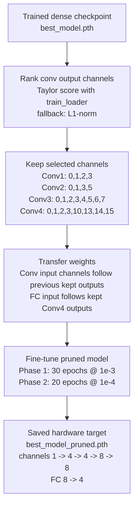
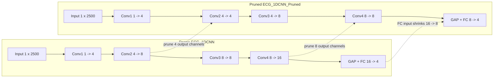

# ECG 1D-CNN Model Diagrams

Source files:

- `software/python/model/model.py`: `ECG_1DCNN`
- `software/python/prune_finetune.py`: `ECG_1DCNN_Pruned`
- `software/python/results/v3_results_pruned.json`: saved pruning metadata

## Dense Model: `ECG_1DCNN`

```mermaid
flowchart LR
    X["Input ECG\n(B, 1, 2500)"]
    C1["Conv1d\n1 -> 4, K=5, P=2\nbias=True\n(B, 4, 2500)"]
    P1["MaxPool1d\nK=5\n(B, 4, 500)"]
    C2["Conv1d\n4 -> 8, K=5, P=2\nbias=True\n(B, 8, 500)"]
    P2["MaxPool1d\nK=5\n(B, 8, 100)"]
    C3["Conv1d\n8 -> 8, K=5, P=2\nbias=True\n(B, 8, 100)"]
    P3["MaxPool1d\nK=5\n(B, 8, 20)"]
    C4["Conv1d\n8 -> 16, K=5, P=2\nbias=True\n(B, 16, 20)"]
    R4["ReLU\nonly after Conv4"]
    P4["MaxPool1d\nK=5\n(B, 16, 4)"]
    GAP["AdaptiveAvgPool1d(1)\n(B, 16, 1)"]
    S["squeeze(-1)\n(B, 16)"]
    FC["Linear\n16 -> 4\n(B, 4 logits)"]
    Y["Classes\nAFIB / GSVT / SB / SR"]

    X --> C1 --> P1 --> C2 --> P2 --> C3 --> P3 --> C4 --> R4 --> P4 --> GAP --> S --> FC --> Y
```

Dense parameter count: `1244`.

| Layer | Channels | Output shape | Parameters |
|---|---:|---:|---:|
| Input | 1 | `(B, 1, 2500)` | - |
| Conv1 + Pool | `1 -> 4` | `(B, 4, 500)` | 24 |
| Conv2 + Pool | `4 -> 8` | `(B, 8, 100)` | 168 |
| Conv3 + Pool | `8 -> 8` | `(B, 8, 20)` | 328 |
| Conv4 + ReLU + Pool | `8 -> 16` | `(B, 16, 4)` | 656 |
| GAP | - | `(B, 16)` | - |
| FC | `16 -> 4` | `(B, 4)` | 68 |

## Pruned Model: `ECG_1DCNN_Pruned`

```mermaid
flowchart LR
    X["Input ECG\n(B, 1, 2500)"]
    C1["Conv1d\n1 -> 4, K=5, P=2\nbias=True\n(B, 4, 2500)"]
    P1["MaxPool1d\nK=5\n(B, 4, 500)"]
    C2["Conv1d\n4 -> 4, K=5, P=2\nbias=True\n(B, 4, 500)"]
    P2["MaxPool1d\nK=5\n(B, 4, 100)"]
    C3["Conv1d\n4 -> 8, K=5, P=2\nbias=True\n(B, 8, 100)"]
    P3["MaxPool1d\nK=5\n(B, 8, 20)"]
    C4["Conv1d\n8 -> 8, K=5, P=2\nbias=True\n(B, 8, 20)"]
    R4["ReLU\nonly after Conv4"]
    P4["MaxPool1d\nK=5\n(B, 8, 4)"]
    GAP["AdaptiveAvgPool1d(1)\n(B, 8, 1)"]
    S["squeeze(-1)\n(B, 8)"]
    FC["Linear\n8 -> 4\n(B, 4 logits)"]
    Y["Classes\nAFIB / GSVT / SB / SR"]

    X --> C1 --> P1 --> C2 --> P2 --> C3 --> P3 --> C4 --> R4 --> P4 --> GAP --> S --> FC --> Y
```

Pruned parameter count: `640`, reduction `48.55%`.

| Layer | Channels | Output shape | Parameters |
|---|---:|---:|---:|
| Input | 1 | `(B, 1, 2500)` | - |
| Conv1 + Pool | `1 -> 4` | `(B, 4, 500)` | 24 |
| Conv2 + Pool | `4 -> 4` | `(B, 4, 100)` | 84 |
| Conv3 + Pool | `4 -> 8` | `(B, 8, 20)` | 168 |
| Conv4 + ReLU + Pool | `8 -> 8` | `(B, 8, 4)` | 328 |
| GAP | - | `(B, 8)` | - |
| FC | `8 -> 4` | `(B, 4)` | 36 |

## Structured Channel Pruning

## Dense vs Pruned

